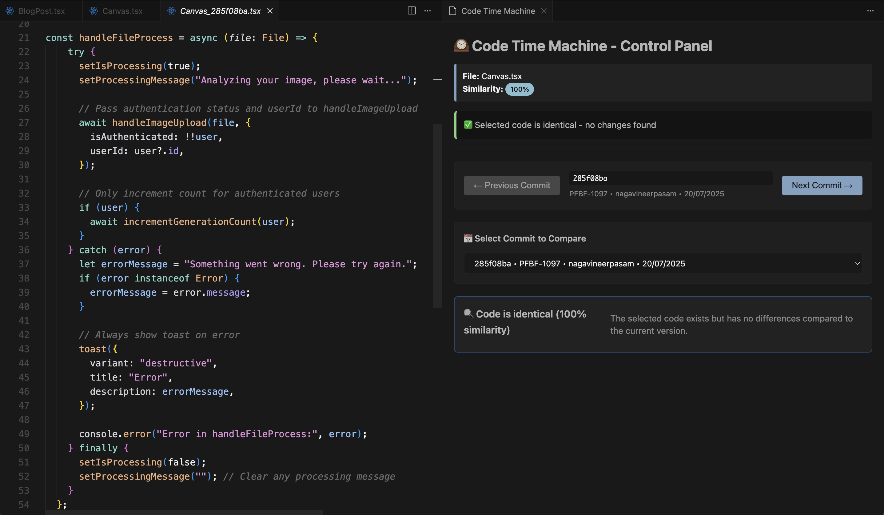
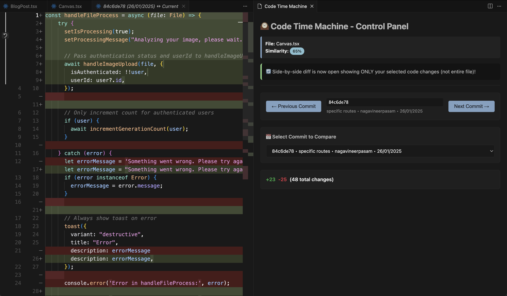

# 🕰️ Code Time Machine

A VS Code extension that lets you view how functions and code blocks evolved across Git commits with beautiful side-by-side diffs.

### Extension in Action




### Installation
https://marketplace.visualstudio.com/items?itemName=vineer.code-time-machine

## 🚀 Quick Start

1. **Install the Extension**
2. **Open a file** in a Git repository
3. **Select a function or code block** you want to analyze
4. **Right-click** and choose "Code Time Machine: Show History"
   - Or use Command Palette: `Ctrl+Shift+P` → "Code Time Machine: Show History"

## ✨ Features

- **Function Evolution Tracking**: Select any function or code block and see how it changed over time
- **Smart Code Parsing**: Uses Babel/TypeScript AST parsing to accurately identify functions across commits
- **Side-by-Side Diff View**: Beautiful webview with syntax highlighting and inline change markers
- **Git Integration**: Works with any Git repository - fetches commit history automatically
- **Timeline Navigation**: Browse through commits with Previous/Next buttons or click directly on the timeline
- **Similarity Analysis**: Shows percentage similarity between versions
- **Context Menu Integration**: Right-click on selected code to access the time machine

## 📋 Requirements

- VS Code 1.60.0 or higher
- Git repository (the file must be tracked by Git)
- Node.js and npm (for development)

## 🔧 Development Setup

```bash
# Clone or navigate to the extension directory
cd code-time-machine

# Install dependencies
npm install

# Compile TypeScript
npm run compile

# Open in VS Code for development
code .
```

### Testing the Extension

1. Press F5 or click on Run > Start Debugging to open a new Extension Development Host window.
2. Open a Git repository with JavaScript/TypeScript files
3. Select a function and test the "Code Time Machine: Show History" command

## 🎯 Supported Languages

- **JavaScript** (.js, .jsx)
- **TypeScript** (.ts, .tsx)
- **Fallback Regex Parsing** for other languages

## 🖥️ How It Works

1. **Code Selection**: When you select code, the extension identifies the containing function using AST parsing
2. **Git History**: Fetches the last 10 commits that modified the current file
3. **Historical Analysis**: For each commit, retrieves the file content and extracts the same function
4. **Diff Generation**: Creates side-by-side diffs showing exactly what changed
5. **Interactive Timeline**: Navigate through commits to see the evolution step-by-step

## 📁 Project Structure

```
code-time-machine/
├── src/
│   ├── extension.ts       # Main extension logic
│   ├── gitUtils.ts        # Git operations wrapper
│   ├── parser.ts          # Code parsing with Babel/TypeScript
│   ├── diffUtils.ts       # Diff generation and formatting
│   └── webview/
│       └── panel.ts       # Webview UI for displaying diffs
├── package.json           # Extension manifest
├── tsconfig.json         # TypeScript configuration
└── README.md             # This file
```

## 🐛 Known Issues

- Large files (>1000 lines) may take longer to parse
- Binary files are not supported
- Renamed functions across commits might not be tracked perfectly


## 🙏 Acknowledgments

- Built with [VS Code Extension API](https://code.visualstudio.com/api)
- Uses [simple-git](https://github.com/steveukx/git-js) for Git operations
- AST parsing powered by [Babel](https://babeljs.io/)
- Diff generation using [diff](https://github.com/kpdecker/jsdiff)

---

**Happy time traveling through your code! 🚀**
